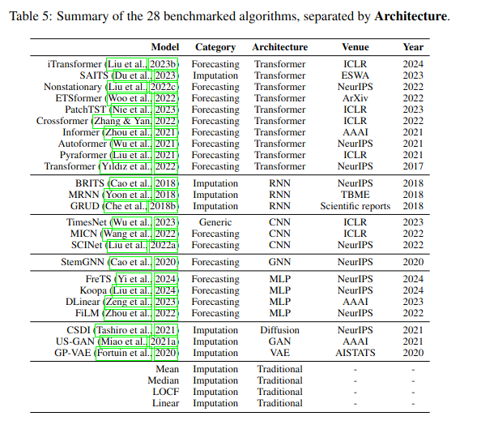

# TimeSeries

  

## **Imputation**

Temporal dependence characterizes time series data because observations close in time tend to be similar compared to cross-sectional data.

### Missing mechanisms [Rubin, 1976](https://academic.oup.com/biomet/article/63/3/581/270932)

1. MCAR
2. MAR
3. MNAR

### Missing Patterns

1. point missing
2. subsequence missing
3. block missing

### Statistical methods of imputation

1. deletion
2. constant imputation
3. locf - last obs carried forward
4. nocb - next obs carried backward
5. mean/median/mode
6. rolling statistics
7. linear interpolation
8. spline interpolation
9. KNN
10. regression
11. seasonal trend decomposition using Loess (STL)

### Papers

1. [TimesNet](https://openreview.net/pdf?id=ju_Uqw384Oq) ---> [Github - TSLib](https://github.com/thuml/Time-Series-Library)  

    TSLib/TimesNet only supports point-missing pattern. They randomly mask the time-points in the ratio of {12.5%, 25%, 37.5%, 50%}.  

    Results for Autoformer (Weather dataset)

    | Mask Rate | MSE                | MAE                |
    |-----------|--------------------|--------------------|
    | 12.5%     | 0.3128             | 0.4111             |
    | 25%       | 0.3024             | 0.3879             |
    | 37.5%     | 0.1488             | 0.2562             |
    | 50%       | 0.1428             | 0.2470             |

    More masking → model sees less observed data but is forced to learn deeper temporal dependencies and structural patterns.  
    This leads to more robust representations, like how dropout improves generalization by preventing over-reliance on specific inputs.     

    Results for Timesnet (Weather dataset)

    | Masking Ratio |     MAE     |     MSE     |
    |:-------------:|:-----------:|:-----------:|
    |     0.125     | 0.04593     | 0.02517     |
    |     0.25      | 0.05506     | 0.02932     |
    |     0.375     | 0.05704     | 0.03088     |
    |     0.5       | 0.06148     | 0.03413     |

    Timesnet performance decreases with the increase in masking ratio, but Autoformer performance increases.  
    Although, Timesnet performs much better at TS-imputation task. it also tops the TSlib leaderboard for this task.

    Extension of this paper - [Deep TS Models](https://arxiv.org/pdf/2407.13278)  

2. [MTSI with Transformers](https://ieeexplore.ieee.org/stamp/stamp.jsp?tp=&arnumber=9964035)  

    This paper uses 2 datasets -
    1. physionet 2012 (clinical dataset) - As the dataset has no ground truth, 10/50/90% of the observed values in the test data are taken as ground truths for which the input data is masked with the Bernoulli distribution.  
    2. beijing air quality - uses block-missing pattern. There is already 13% missing data. For each missing data-point, the succeeding month's data-point is taken as the ground truth. For example, if 24th Feb is missing, the ground truth to this is 24th March.

3. [TSI-Bench](https://arxiv.org/pdf/2406.12747) ---> [Github - Awesome Imputation](https://github.com/WenjieDu/Awesome_Imputation)  
    TSIBench supports all three missing patterns - point, subseq and block.  
    

4. [DL for MTSI](https://arxiv.org/pdf/2402.04059) ----> [Pypots imputations](https://docs.pypots.com/en/latest/pypots.imputation.html)  
   

## **Classification**

  

### Papers

1. [Transformers in TS - IJCAI](https://www.ijcai.org/proceedings/2023/0759.pdf)
2. [DL for TSC](https://arxiv.org/pdf/1809.04356) - mlp, cnn, rnn/esn, fcn, resnet, encoder, mcnn, t-LeNet, mcdcnn, time-cnn
3. [Voice2Series - ICML](https://arxiv.org/pdf/2106.09296) - Achieves SOTA in 19 datasets ($xt​=Pad(xt​)+δ$) - [Github](https://github.com/huckiyang/Voice2Series-Reprogramming)  
    Padding reprogramming — where the padded portion is replaced by a trainable additive vector $δ=M⊙θ$
4. [Aeon library](https://www.aeon-toolkit.org/en/latest/api_reference/classification.html)

### Discriminative region

A discriminative region is the subsequence of a time series that contains the most informative features for classifying the time series into the correct class.

| Method                    | How it finds the discriminative region                                |
| ------------------------- | --------------------------------------------------------------------- |
| **Shapelets**             | Learns short subsequences that best separate classes (e.g., slant)    |
| **Saliency/Grad-CAM**     | Highlights time points where gradients w\.r.t. output are strongest   |
| **Attention models**      | Learn to focus on regions (middle slant) with highest class-relevance |
| **Class activation maps** | Show which part of input most influences the predicted class          |
| **Manual inspection**     | Plotting and observing differences (used in early literature)         |

  

## **Anomaly Detection**

  

Training loop often doesn't have labels.  
The model is trained to re-construct normal (non-anomalous) data.  
For normal samples, reconstruction error should be low.  
For anomalous samples, reconstruction error should be high (since it is unseen data. Model predicted normal data, but original data has an anomaly)  

### Evaluation

1. Calculate reconstruction error(MSELoss) between pred and output - `score = torch.mean(self.anomaly_criterion(batch_x, outputs), dim=-1)`
2. Concat all errors into a single array
3. Find the threshold percentile (Any test sample with a reconstruction error above this threshold (the top 1% highest errors) is flagged as an anomaly.) - `threshold = np.percentile(combined_energy, 100 - self.args.anomaly_ratio)`
4. Filter all predictions by checking which are more than threshold - `pred = (test_energy > threshold).astype(int)`

### Anomaly Patterns

1. **Point anomalies** (point-based) refer to data points that deviate remarkably from the rest of the data.
2. **Contextual anomalies** (point-based) refer to data points within the expected range of the distribution (in contrast to point anomalies) but deviate from the expected data distribution, given a specific context (e.g., a window).
3. **Collective anomalies** (sequence-based) refer to sequences of points that do not repeat a typical (previously observed) pattern.

### Papers

1. [Dive into TS AD](https://arxiv.org/pdf/2412.20512) - describes many methods
2. [AnomalyBert - ICLR](https://arxiv.org/pdf/2305.04468) - [Github](https://github.com/Jhryu30/AnomalyBERT) -   processes time series in patches (small groups of points). Unlike the original Transformer or ViT, we do not use sinusoidal positional encodings or absolute position embeddings to inject positional information. We instead add 1D relative position bias to each attention matrix to consider the relative positions between features in a window.

## Forecasting

1. training

    | Aspect | Short-Term | Long-Term | Difference |
    | ------ | -----------| ---------- | ---------- |
    | Time features            | ❌ Not used                                                                               | ✅ Uses `batch_x_mark` and `batch_y_mark`                   | Short-term often uses raw ts only                              |
    | Model Call                | `self.model(batch_x, None, dec_inp, None)`                                               | `self.model(batch_x, batch_x_mark, dec_inp, batch_y_mark)` | Long-term uses full context                                    |
    | Loss Calculation          | `criterion(batch_x, freq_map, outputs, batch_y, batch_y_mark)` + optional sharpness loss | `criterion(outputs, batch_y)`                              | Short-term loss may include frequency/temporal sharpness terms |
    | Sharpness Regularization  | ✅ `MSE(output diffs, target diffs)` — optional                                           | ❌ Not applied                                              | Unique to short-term variant                                   |
    | Use of Frequency Map      | ✅ Passed to loss (for frequency-aware loss function)                                     | ❌ Not used in long-term training                           | Short-term focuses on frequency                                |

2. validation

    | Feature            | Short-Term              | Long-Term                        |
    | ------------------ | ----------------------- | -------------------------------- |
    | # of test samples  | 1 (last training slice) | Many (rolling across test set)   |
    | Loop over batches  | ❌                       | ✅                                |
    | Decoder input      | Single sample           | Reconstructed per batch          |
    | Time marks used    | ❌                       | ✅                                |
    | Inverse scaling    | Optional, less common   | Common in scaled datasets        |
    | Evaluation metrics | Often skipped           | Full set + DTW                   |

### Statistical methods for forecasting [Paper](https://www.researchgate.net/publication/352986678_Comparison_of_Forecasting_Techniques_for_Short-term_and_Long-term_Real_Life_Problems)

1. Simple Exponential Smoothing
2. Holt's method (Double Exponential Smoothing)
3. Holt-Winter's method (Triple Exponential Smoothing)
4. Holt-Winter's Method with Multiplicative Seasonality
5. Holt-Winter's Method with Additive Seasonality

### Papers

1. [MDMixer](https://arxiv.org/pdf/2505.08199)
2. [CrossLinear](https://arxiv.org/pdf/2505.23116)
3. [LogoLLM](https://arxiv.org/pdf/2505.11017)